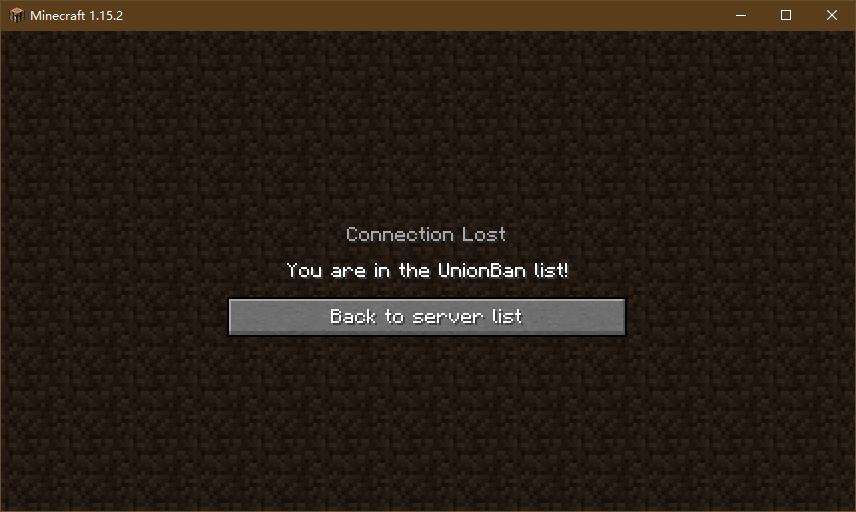
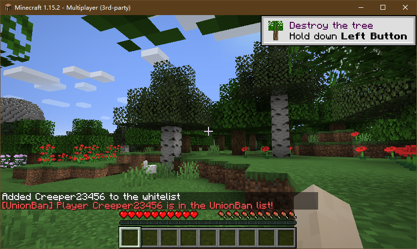

## UnionBan客户端：Spigot插件

### 项目介绍

UnionBan官网：https://unionban.icu/

申请加入：https://unionban.icu/join-us/

UnionBan中央服务器有一份联合封禁名单。参与此项目的Minecraft服务器安装此Spigot插件。管理员安装此插件，可阻止列入封禁名单的玩家进入服务器，也可以通过此插件修改封禁名单。

### 插件功能

插件不修改服务器的白名单（`whitelist.json`）和黑名单（`banned-players.json`），所有功能仅在插件启用时生效。

#### 基础功能（不需要账号，安装即可使用）

- 封禁列表中的玩家试图进入服务器时将其踢出；

- 管理员为玩家添加白名单时，如果此玩家在封禁列表中，发出警告。


#### 高级功能（需要账号）

- 登录账号；
- 将玩家添加到联合封禁列表中；
- 将玩家从联合封禁列表中移除。

#### 命令用法

```
/unionban help - 显示帮助
/unionban status - 显示服务器是否在线、服务端版本以及登录状态
/unionban login <用户名> <密码> - 登录
/unionban logout - 退出登录
/unionban ban <玩家名称> - 将玩家添加到联合封禁名单
/unionban pardon <玩家名称> - 将玩家从联合封禁名单中移除
```

插件将登录信息存储到`plugins/UnionBan-Client/config.yml`中。不推荐手动修改此文件的内容。插件加载时从`config.yml`中读取登录信息，自动登录。

#### 配置文件

```yaml
# UnionBan server address
ServerAddress: "https://api.unionban.icu"
# Login information.
# Do NOT change these manually!
username: ""
password: ""
api_key: ""
```

`ServerAddress`为联合封禁服务器的地址，管理员选择延迟较低的一个节点填入。

`username`，`password`和`api_key`为登录信息，管理员请**不要**手动更改，请使用`login`和`logout`子命令登录或登出账号。

#### 权限节点

`unionban.info`：默认所有玩家拥有。权限影响获取插件和服务端状态：

- `/unionban help`
- `/unionban status`

`unionban.account`：默认管理员拥有。权限影响修改账户信息：

- `/unionban login <username> <password>`
- `/unionban logout`

`unionban.ban`：默认管理员拥有。权限影响修改封禁名单：

- `/unionban ban <player>`
- `/unionban pardon <player>`

### 开发相关

欢迎提issue或者pull request。

项目使用JDK 1.8和maven，建议使用IDEA。

#### TODO

- [ ] 复用HTTPS连接；
- [ ] 整理与服务端通信的代码，移到单独的repo中

### 修改历史

#### v1.0.1

可以在配置文件中修改联合封禁服务端的地址，并可在插件启动时及`/unionban status`命令输出中看到当前设置。

#### v1.0.0

完成基础功能。